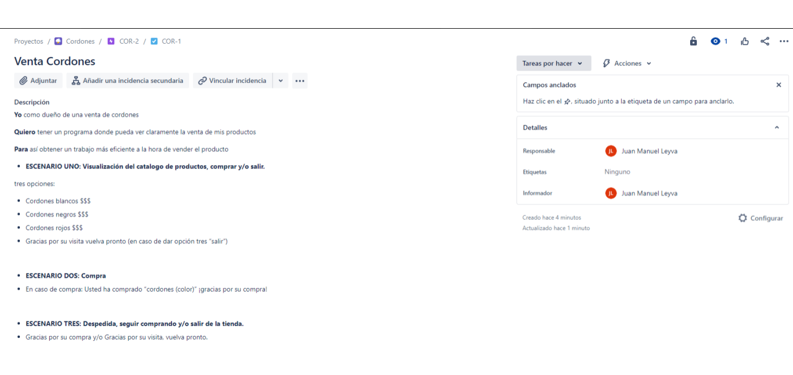
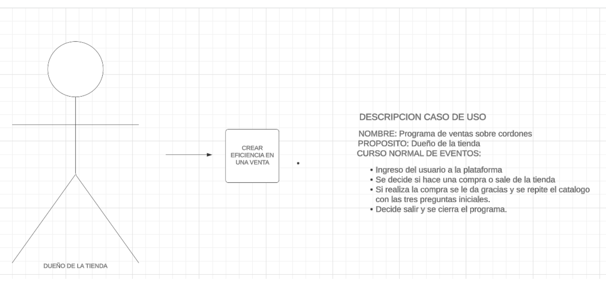
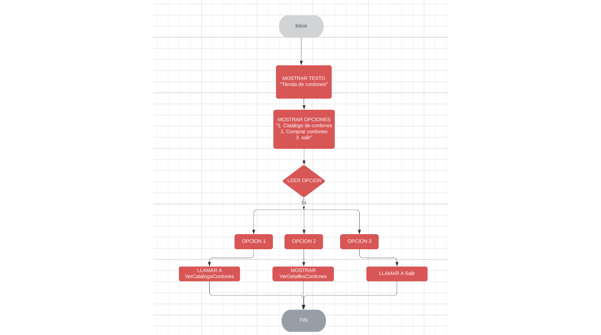

# INICIO PROYECTO 
Se usa un progama en BlueJ para probrar la venta de cordones para zapatos.
el usuario debe seleccionar dentro de 3 opciones las cuales son:
- Catalogo de cordones
- Comprar
- Salir
despues de tomar su decisión el programa arrojará varias opciones donde el usuario elegira 
a su conveniencia.

## REQUISITOS
- Java JDK instalado (no se requiere la version mas reciente)
- IDE para java (a conveniencia)

## INSTRUCCIONES 
- Realizar la descarga del archivo que se encuentra en el repositorio
- En el IDE procede a abrir el archivo (nombre.java) y luego ejecutar el programa despues de compilar.

## FUNCIONES 
- Ofrece una eficiencia a la hora de realizar ventas de algun producto
- Se muestra en pantalla el precio y el articulo que se ha comprado para una mayor fiabilidad
- Ofrece la posibilidad de realizar cambios a futuro ya que su codigo es sencillo y facil de entender. 

### PSEUDOCODIGO

    tienda <- Tienda()

    Repetir
        Escribir("=== Tienda de Cordones ===")
        Escribir("1. Ver catálogo de cordones")
        Escribir("2. Comprar cordones")
        Escribir("3. Salir")
        Escribir("Ingrese una opción: ")
        Leer(opcion)

        Segun opcion Hacer
            Caso 1:
                tienda.verCatalogoCordones()
            Caso 2:
                tienda.comprarCordones()
            Caso 3:
                Escribir("Gracias por visitar la tienda. ¡Hasta luego!")
            Otro Caso:
                Escribir("Opción inválida. Por favor, ingrese una opción válida.")
        Fin Segun
    Hasta Que opcion = 3 

    Procedimiento comprarCordones()
        Definir opcion Como Entero

        Escribir("=== Comprar Cordones ===")
        Escribir("1. Cordones Negros - $10")
        Escribir("2. Cordones Blancos - $12")
        Escribir("3. Cordones Rojos - $15")
        Escribir("Ingrese el número de cordones que desea comprar: ")
        Leer(opcion)

        Segun opcion Hacer
            Caso 1:
                Escribir("Ha comprado Cordones Negros por $10. ¡Gracias por su compra!")
            Caso 2:
                Escribir("Ha comprado Cordones Blancos por $12. ¡Gracias por su compra!")
            Caso 3:
                Escribir("Ha comprado Cordones Rojos por $15. ¡Gracias por su compra!")
            Otro Caso:
                Escribir("Opción inválida. Por favor, ingrese una opción válida.")
        Fin Segun
    FinProcedimiento

## JIRA

## CASO DE USUARIO

## DIAGRAMA DE FLUJO

